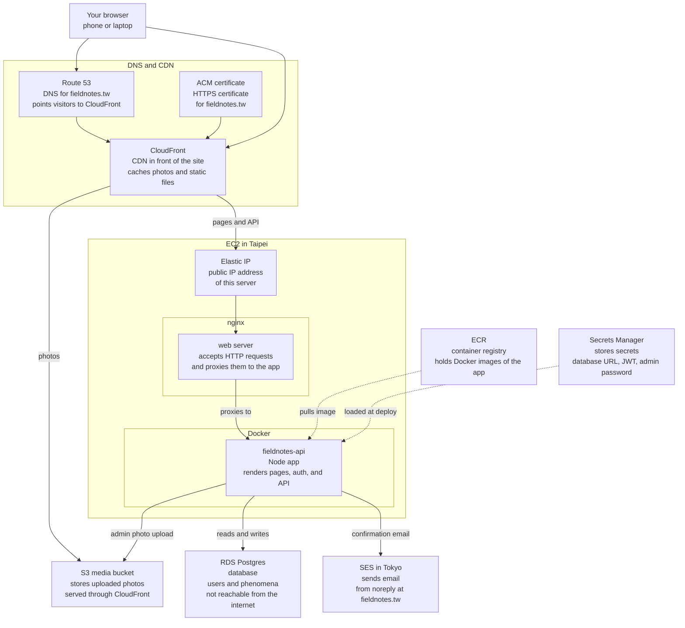

# fieldnotes.tw · 最近左營

A local phenomena guide — what’s blooming, fruiting, in season, or happening right now. Not a tourist map of sights, but a living notebook of place.

Homepage prototype + TypeScript API.

## Run locally

### Docker Compose (dev + live reload)

```bash
npm run compose:up          # Postgres + API with bind-mounted repo + Vite HMR
# Site: http://127.0.0.1:3001/
# Admin: admin@fieldnotes.tw / replace-me
# Confirmation links print in: npm run compose:logs
npm run compose:down
```

Edit files on the host; the container bind-mounts the repo. Client JS/CSS get Vite HMR; templates and `/js/*` trigger a full reload. Server TypeScript reloads via `tsx watch`.

### Host process (optional)

Same app, Postgres still from Compose:

```bash
npm run db:up
npm install && npm --prefix server install
cp server/.env.example server/.env   # includes SEED_DEMO=1 for local
npm run db:push
npm run db:seed      # or: npm run db:reseed
npm run dev
```

- Site: [http://127.0.0.1:3001/](http://127.0.0.1:3001/)
- Clean routes: `/`, `/login`, `/register`, `/confirm`, `/admin`, `/submit`
- API health: [http://127.0.0.1:3001/api/health](http://127.0.0.1:3001/api/health)
- Phenomena: `GET /api/phenomena`

Production builds hashed assets with `npm run build` and serves them from the API image (`server/Dockerfile`).

Demo photos stay in [`public/images/`](public/images/) and are copied into `server/public/media/` only for local serving (`npm run seed:media-local`). They are **not** part of the production asset bundle; staging/prod media is S3. Production boots with an empty catalog (admin user only) unless you create real content in the admin UI.

Seed an admin (local): set `ADMIN_EMAIL` / `ADMIN_PASSWORD` in `server/.env`, then `npm run db:seed`. Demo phenomena require `SEED_DEMO=1`. Admin UI: `/admin`. Registration requires email confirmation (`MAIL_MODE=log` prints the link locally).

## How it runs on AWS

How the live site is put together on AWS. There are two copies of almost everything — **staging** (for trying changes) and **production** (the real site). Same layout; different addresses.



### What happens when someone visits

1. Their browser looks up `fieldnotes.tw` (Route 53) and lands on CloudFront.
2. **Photos** (`/media/…`) come from the S3 media bucket through CloudFront.
3. **Everything else** (home page, login, API) goes to the EC2 server: nginx receives it, then the Docker app answers.
4. The app reads and writes data in Postgres, which has no public address of its own.

### Staging vs production

| | Staging | Production |
|---|---|---|
| Purpose | Try changes safely | The live site |
| Address | `staging.fieldnotes.tw` | `fieldnotes.tw` and `www` |

Each environment has its own server, database, photo bucket, and CloudFront distribution. Confirmation email (SES) is shared.

More detail: [`infra/README.md`](infra/README.md).
